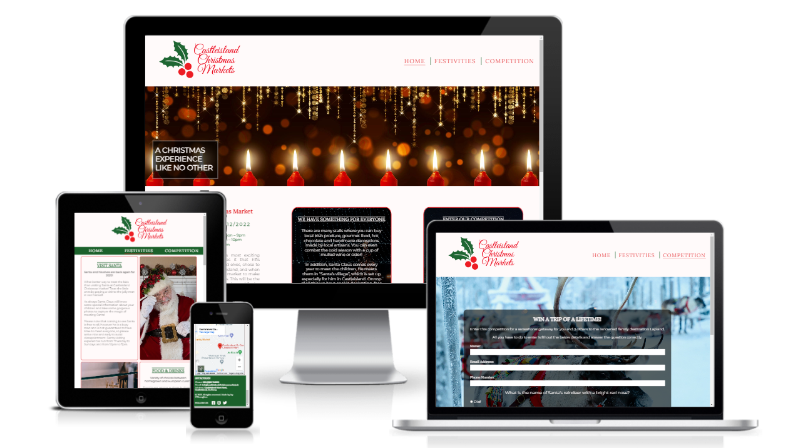
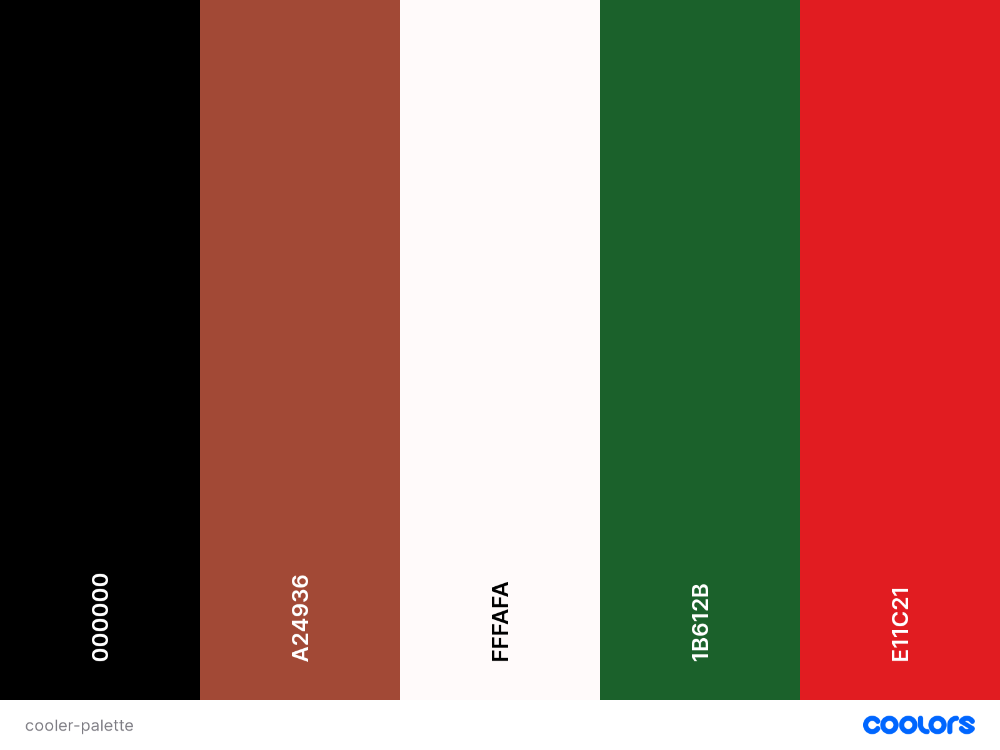

# Castleisland Christmas Markets Website

Castleisland Christmas Markets is a Project Portfolio 1 creation for the Code Institiute course. The website is designed to be fully reponsive, allowing visitors to interact and view its content on a range of devices and screen sizes. The objective of the website is to spread awareness of the markets and provide clear and consise information to the public in relation to the resources that are on offer. 

   

[View Castleisland Chritmas Markets live website on Github pages here](https://jayodonoghue.github.io/Castleisland-Christmas-Markets/)

---
    

## User Experience (UX)  

  

#### Key information for the site 

* Details of what the stalls in the markets offer.
* Dates on when the market will be taking place.
* How to get in contact.
* How to enter the competition to Lapland.

   

### User Stories

   

#### First Time Visitors Goals

* I want the site to provide information on the activities and availability of services from the markets.
* I want to be able to be easily navigate through this site.
* I want to be able to access their social media links.
* I want to be able to enter the competition.

#### Returning Visitor Goals

* I want to be able to get in contact with the markets for any queries that I have.
* I want to know where the markets are taking place.

#### Frequent Visitor Goals

* I want to be able to come back every year with updated dates and times available.

#### CLient Goals

* To provide clear information for potential visitors.
* To provide a way for visitors to get in contact.
* To provide a website that is intuitive.
* To promote the Castleisland Christmas Markets.

 

---

## Design

 

### Colour Scheme

 

The colours used in the website were based off the colours used in the logo. The colour palette was then created by using the [Coolors](https://coolors.co/) website.

 

### Typography

The following two fonts were picked as they complimented each other.

 * Lora is used for the headers on the site. This is a serif font.
 * Montserrit is used for the remainder of the text areas. This is  sans-serif font.
