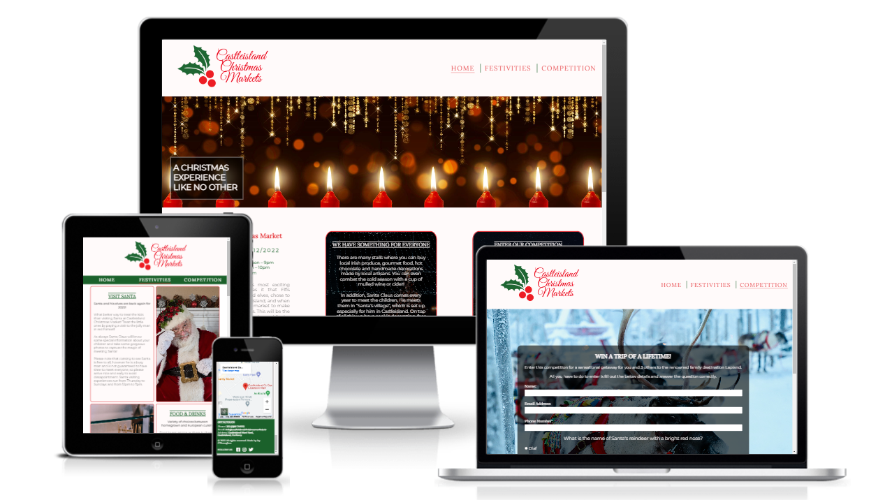

# Castleisland Christmas Markets Website

Castleisland Christmas Markets is a Project Portfolio 1 creation for the Code Institiute course. The website is designed to be fully reponsive, allowing visitors to interact and view its content on a range of devices and screen sizes. The objective of the website is to spread awareness of the markets and provide clear and consise information to the public in relation to the resources that are on offer. 

[View Castleisland Chritmas Markets live website on Github pages here](https://jayodonoghue.github.io/Castleisland-Christmas-Markets/)