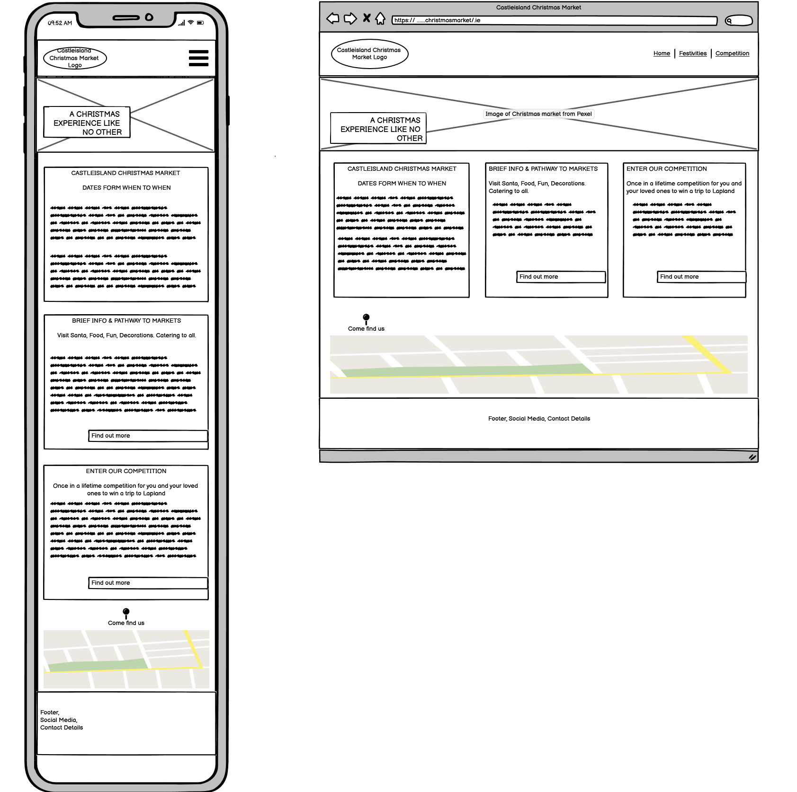
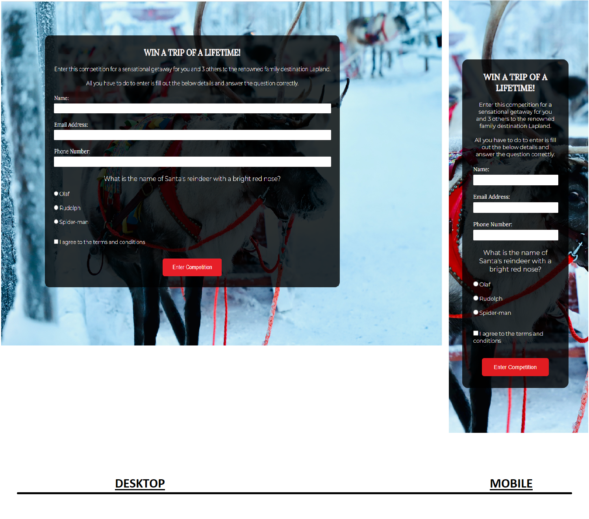

# Castleisland Christmas Markets Website

 

Castleisland Christmas Markets is a Project Portfolio 1 creation for the Code Institiute course. The website is designed to be fully reponsive, allowing visitors to interact and view its content on a range of devices and screen sizes. The objective of the website is to spread awareness of the markets and provide clear and consise information to the public in relation to the resources that are on offer. 

   

[View Castleisland Chritmas Markets live website on Github pages here](https://jayodonoghue.github.io/Castleisland-Christmas-Markets/)

---
    

## User Experience (UX)  

  

#### Key information for the site 

* Details of what the stalls in the markets offer.
* Dates on when the market will be taking place.
* How to get in contact.
* How to enter the competition to Lapland.

   

### User Stories

   

#### First Time Visitors Goals

* I want the site to provide information on the activities and availability of services from the markets.
* I want to be able to be easily navigate through this site.
* I want to be able to access their social media links.
* I want to be able to enter the competition.

#### Returning Visitor Goals

* I want to be able to get in contact with the markets for any queries that I have.
* I want to know where the markets are taking place.

#### Frequent Visitor Goals

* I want to be able to come back every year with updated dates and times available.

#### CLient Goals

* To provide clear information for potential visitors.
* To provide a way for visitors to get in contact.
* To provide a website that is intuitive.
* To promote the Castleisland Christmas Markets.

 

---

## Design

 

### Colour Scheme

 

The colours used in the website were based off the colours used in the logo. The colour palette was then created by using the [Coolors](https://coolors.co/) website.

 

### Typography

 

The following two fonts were picked as they complimented each other.

 * Lora is used for the headers on the site. This is a serif font.
 * Montserrat is used for the remainder of the text areas. This is  sans-serif font.

 

 ### Imagery

 

 All images are taken from image sharing websites such as pxhere, pexels and unspla. These are correctly credited in the credits section.

 

### Wireframes

 

Wireframes were created for mobile and desktop.

 

Home Page

 

Festivities Page

 

Competition Page

 

### Features

 

The website is made up of three pages. All of which are accessible from the navigation menu. 

 

* All pages have:
  * A responsive navigation bar at the top of the page. This allows users to access every aspect of the site. The left of the navigation bar contains a logo which has the text 'Castleisland Christmas Markets'. This logo also acts as a link to the home page once clicked. To the right of the navigation bar there are links to the websites pages (Home, Festivities & Competition). Once the screen size is 600px or under the links to the right of the navigation bar are changed to a hamburger style menu. This is done to prmote a good user experience in providing an uncluttered look to the navigation bar on smaller screens. 

  

   

  * A footer which contains contact information, a copyright text which also states the creator of the page and also social media links. These links are shown as icons to give a cleaner more modern look.

  

 

* The Home Page has:  
  * A Hero image section. This image is of shimmering crystals and candles. Image used to implement a festive tone.

  

   

  * An Information and Pathway Section. This section comprises of three subsections (div containers). The first div includes dates, times and a brief introduction. The second div contains what activties are available. The third div informs you of the competition.

  

   

  * A map section. The map section provides a google maps iframe which will show exactly where the markets take place.

  

 
 
 * The Festivities Page has:  
   * A festivities grid section. This section is broken down into ten subsections. There are five div containers with text, each describing what different activities and experiences are available at the markets. There are equally five other div containers that are images in relation the text div adjacent (in desktop version) or above it (mobile version).

   

 

* The Competition Page:  
  * A background image. This image is of a reindeer in Lapland. It is used as a decorative image to convey a message of what to expect if won.
  * A form. This is used to allow the visitors to enter their details and enter the competition. It is made up of name, email address, phone number, radio buttons for the possible answers, a checkbox to agree to the terms and conditions and an enter competition submit button. All input area must be filled in order to enter if not a message appears on screen to instruct users to complete areas that have been left blank.

  

 

* Future Implementations:
  * To create a gallery page. This would include images of some of the products that are available in the markets, people partaking in activities available in the markets and just of the market in gerneral. These would help first time visitors have a greater knowledge of what to expect if coming to see the markets.
  * A terms and conditions link to a seperate page. This would have the full details of the terms and conditions involved in the competition involved with entering the competition.
  * A thank you for entering page. Once the submit button is clicked the user is brought to a thank you for entering page and informs them of when the winner will be notified.
  * Use javascript to return to top function on mobile devices.

 

### Accessibility

I have achieved a high level of accessibility by using the following:

* Using aria-labels.
* Ensuring there is a clear colour contrast throught the site. 
* Using semantic HTML.

 

---

 

## Technologies Used

 

### Languages Used

 

* HTML
* CSS 
* JavaScript

### Frameworks, Libraries & Programs Used

 

* Balsamiq - This was used to create the wireframes.
* Git - This was used for version control.
* Github - This was used to save and store all the files for the website.
* Font Awesome - This was used for the icons in the website.
* Google fonts - This was used to import the fonts used for the website.
* Google Dev Tools - This was used to test different code and features.
* Google Map Generator - This was used to generate the map on the index page.
* TinyPNG - This was used to compress images.
* Convertio - This was used to transfer images to webp format.
* Am I Responsive - This was used to show the website on a variety of different screens.

 

---

 

## Testing

 

### HTML Validator

 

The HTML Validator was used on all three pages of the website.